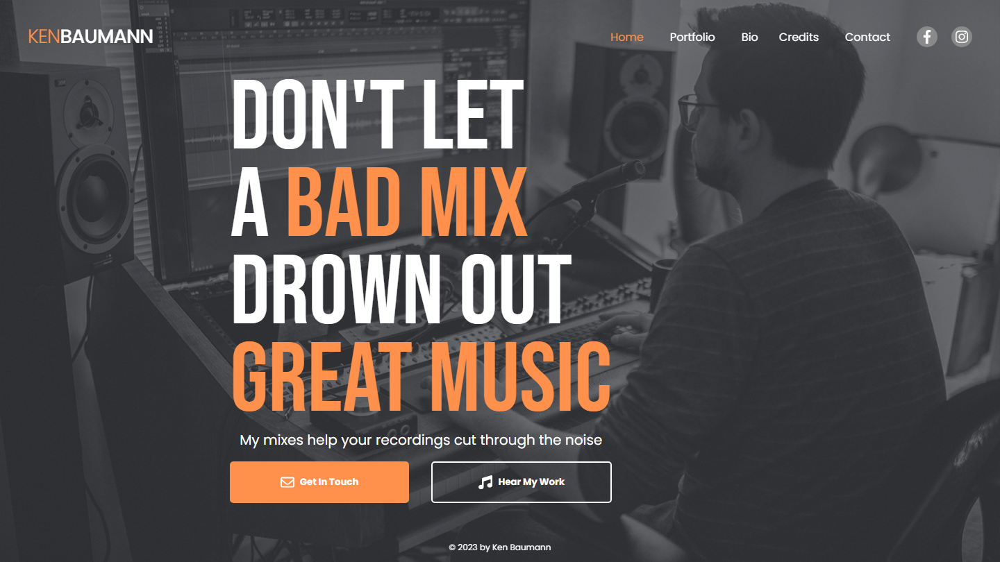
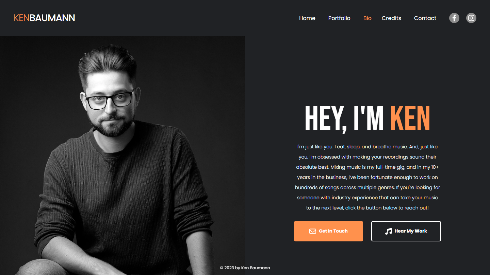
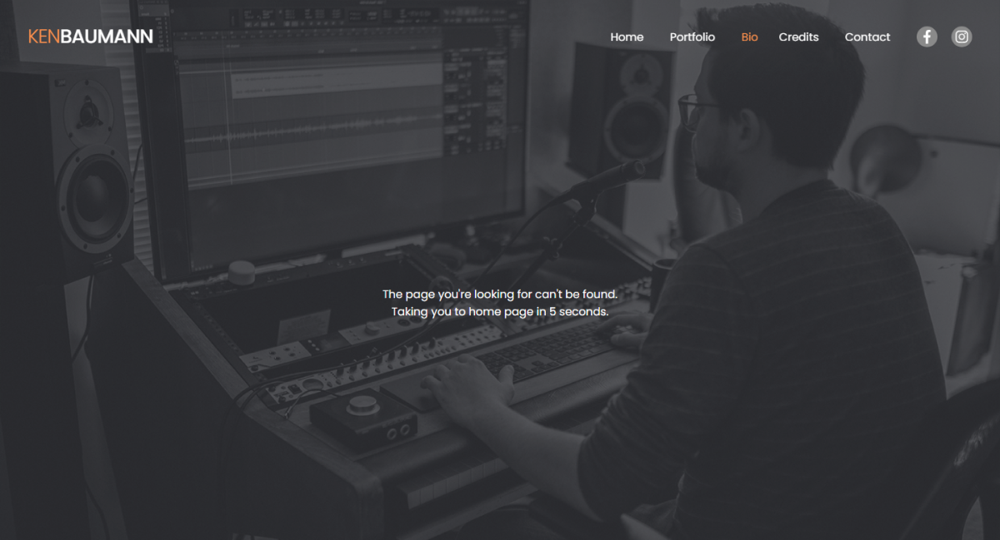
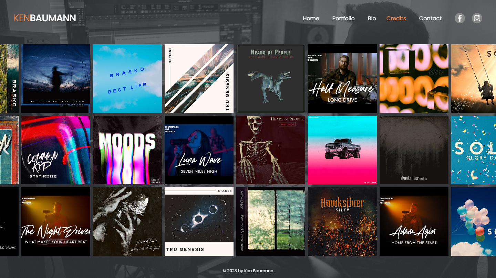

# KenMixesMusic - Audio Engineer Portfolio

This particular client wanted an effective online portfolio to display his work with a design to set himself apart from others in the industry. My build incorporated a reciprocating album image carousel, integration with FilePass, contact form validation and image optimization.

This project is being displayed with the permission of the client. No sensitive information is being provided.

## Overview

### Screenshots

### Site URL

[kenmixesmusic.com](https://kenmixesmusic.com)

### Objectives

The client's needs were straight-forward:

- A sleek design with smooth animations
- A rotating image carousel to display his work
- An expanding sidebar displaying samples of his music hosted on FilePass
- A contact form for potential clients to get in touch

My additional requirements were to optimize images according to screen size and provide seemless form validation for the contact form.

## My Process

### Design

I began this project with a basic Figma design file where I decided the overall layout and architecture. I started with desktop designs first, and then condensed the information down to a mobile design. I chose this approach vice a mobile-first approach in order to capture all the information the client wanted on the page, then spend the time formatting it for mobile. Following the layout, the color scheme was finalized and images were selected.

After deciding the final design, I optimized all images for various screen sizes to ensure optimal load times for each device. For the main background and client headshot, I cropped and sized 5 separate images for each:

- Mobile (max width 480px) - portrait
- Tablet (max width 768px) - portrait
- Small (max width 1200px) - landscape
- Medium (max width 1600px) - landscape
- Large (max width 3000px) - landscape

The landscape images were designed with laptops in mind for small and medium, and desktops for medium. The large image size was used as a fallback for the largest desktop screens to ensure a high-quality image regardless of screen size.

### The Build

The site architecture is layed out in the following manner:

~~~
- Homepage
|- Bio
|- Credits
- Portfolio (sliding menu)
- Contact (modal)
~~~

I chose to accomplish this using React Router, wrapping all routes in the common '/' route using a PageWrapper component. This component contained the header and footer components to maintain a common flow across all pages.

Outside of the '/' route component lie the Portfolio and Contact components to ensure these are accessible on every route.

Additionally a 'Not Found' component is provided to match all routes not specified in the app router. This component displays a message indicating that the route requested does not exist, and then routes the user back to the homepage after a five second delay, as seen below.

### Challenges

The client requested a reciprocating image carousel for album art, which proved to be a major challenge. The final result can be seen below:

Managing the scroll behavior of the carousel as well as the changing image size between mobile and desktop, all while providing logic to reverse the carousel after reaching the end took several iterations to get operational. Ultimately I decided to utilize state to track the tile size (which was then used to set each tile image style) and use that state, along with the window object's innerWidth property, to calculate how far the carousel had scrolled. The scroll setting was adjusted using a setInterval function to increment the scrollLeft property every 50 ms by either a positive or negative value. When the scroll position reaches the point calculated for screen size, the scroll increment value is flipped to the opposite sign to reverse the direction.

~~~
useEffect(() => {
    const interval = setInterval(() => {
        !scrollPaused && setScrollPosition(prev => prev + scrollIncrement)
    }, 50)

    return () => clearInterval(interval)
}, [scrollPaused, scrollIncrement])

useEffect(() => {
    if (gridRef && gridRef.current) {
        gridRef.current.scrollLeft = scrollPosition

        const { innerWidth } = window
        
        const endBoundary = imgWidth * 19 - innerWidth

        if (scrollPosition > endBoundary) {
            setScrollIncrement(-2)
        }
        if (scrollPosition < -100) {
            setScrollIncrement(2)
        }
    }
}, [scrollPosition, imgWidth])
~~~

Additionally, I provided a method to stop the animation on hover and to navigate via arrow buttons on either side. In this event, a scrollPaused state is set to true and the animation is stopped. If the user navigates using the buttons, the scrollPosition state is updated with this new value and the animation is allowed to continue from the new point.

### External Services

To get the contact form functional I opted for the SendGrid email API service. Since this service cannot be implemented from the frontend, I utilized a cloud function on Firebase to handle the backend request. I implemented a simple Node.js post function using Express and Cors libraries to provide a reliable service.

~~~
const functions = require("firebase-functions");
const express = require('express')
const cors = require('cors')
const sgMail = require('@sendgrid/mail')

const app = express()

app.use(express.json())
app.use(cors())

sgMail.setApiKey(--SENDGRID-API-KEY--)

app.post('/contact', (req, res) => {
    const { firstName, lastName, email, message } = req.body

    const notification = {
        to: --CLIENT-EMAIL--,
        from: --SENDGRID-ACCOUNT-EMAIL--,
        subject: 'New message from kenmixesmusic.com',
        html: `<h2>${firstName} ${lastName} just sent you a message:</h2>
${message}

You can respond to them at <strong>${email}</strong>
`
    }

    sgMail.send(notification)
        .then(() => {
            res.status(200).send({
                success: true
            })
        })
        .catch(err => {
            res.sendStatus(500)
        })
})

exports.app = functions.https.onRequest(app)
~~~

The other external service utilized in this app is the FilePass embedded audio player, which provides an iframe src to embed. This music player comes stylized and accepts rudimentary size options, so the player is mostly unchanged in the application.

### Continued Development

I am working with the client to implement social media support to the application to ensure effective images, titles, and descriptions are being utilized for social media sharing. The client is also interested in incorporating an eCommerce utility on this site to sell his services directly. In the future I will also be working to optimize the animations and controls of the various pages of this app to ensure edge cases that haven't yet been encountered can be accounted for in order to provide the best possible user experience.

## Author

- Portfolio - [ryanbradleyportfolio.com](https://ryanbradleyportfolio.com)
- Professional Services - [ryanbradleywebdev.com](https://ryanbradleywebdev.com)
- Instagram - [@ryanbradley_web_dev](https://www.instagram.com/ryanbradley_web_dev/)